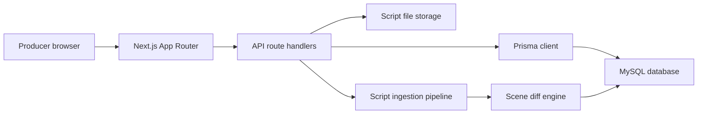
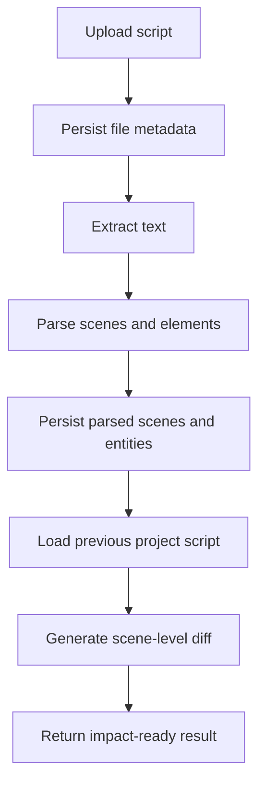

# Hammer Production Tracker Production Architecture

This document describes how Hammer Production Tracker should be structured as it moves from MVP to a production application used by multiple production teams across multiple films.

The guiding product question remains:

> If we change this scene right now, what else breaks?

Every component, API, data model, and workflow should help answer that question quickly in a production meeting.

## System Architecture



## Component Architecture

The UI should be organized around feature workspaces with reusable production-facing primitives.

```text
app/
  page.tsx                                  Executive dashboard
  projects/page.tsx                         Project management
  script-intelligence/page.tsx              Script upload, parsing, diff
  sequences/page.tsx                        Sequence dashboard
  sequences/[id]/page.tsx                   Sequence detail
  scene-linking/page.tsx                    Scene-to-previz linking
  impact/page.tsx                           Change impact engine
  heat-map/page.tsx                         Story stability heat map
  daily-report/page.tsx                     Daily executive report
  api/                                      Server API surface

components/
  app-shell.tsx                             Global navigation and layout
  project-data-boundary.tsx                 Active project data resolver
  ui.tsx                                    Shared studio command-center primitives

lib/
  db.ts                                     Prisma singleton
  mock-data.ts                              MVP fallback data
  project-store.ts                          Browser project cache and fallback
  script-parser.ts                          Script text parser and diff helpers
  pdf-parser.ts                             Browser PDF text extraction
  server-file-storage.ts                    Server upload persistence
  server-script-ingest.ts                   Server-side parse, persist, diff pipeline
  types.ts                                  Domain interfaces
```

### Component Layers

`Route components` are responsible for page composition, data loading, and choosing the correct feature workspace.

`Feature workspaces` own page-specific state, such as selected script version, selected scene, upload state, tabs, and generated impact reports.

`Domain components` render film-specific objects such as sequences, changes, risks, approvals, linked shots, and script diffs.

`UI primitives` provide consistent premium command-center styling without owning business logic.

## Props/API Design

Use typed props that communicate intent and avoid leaking implementation details.

### Shared UI Primitives

```tsx
type PanelProps = {
  children: React.ReactNode;
  className?: string;
};

type SectionHeaderProps = {
  eyebrow?: string;
  title: string;
  action?: React.ReactNode;
};

type StatusBadgeProps = {
  status: Status;
};

type RiskBadgeProps = {
  level: RiskLevel;
};

type ProgressBarProps = {
  value: number;
  tone?: "green" | "amber" | "red";
};

type MetricCardProps = {
  label: string;
  value: string | number;
  sub?: string;
  risk?: RiskLevel;
};

type SequenceCardProps = {
  sequence: Sequence;
  href?: string;
  compact?: boolean;
};
```

Design principle: shared components receive already-normalized data and render it. They should not fetch, mutate, parse, or infer project state.

### Feature Workspace Props

```tsx
type ScriptIntelligenceWorkspaceProps = {
  initialProjectId: string;
};

type ProjectDataBoundaryProps = {
  children: (data: ProjectDataContext) => React.ReactNode;
};

type ProjectDataContext = {
  project: Project;
  sequences: Sequence[];
  scenes: Scene[];
  shots: Shot[];
  previzShots: PrevizShot[];
  departments: Department[];
  risks: Risk[];
  approvals: Approval[];
  scriptVersions: ScriptVersion[];
};
```

Design principle: feature workspaces can own interaction state, but they should receive project identity or project data through a clear boundary.

## API Design

The current API is intentionally small and project-scoped.

### Projects

`GET /api/projects`

Returns all projects visible to the current deployment.

```json
{
  "projects": [
    {
      "id": "project_id",
      "title": "HAMMER",
      "stage": "Development",
      "currentScriptVersion": "S-04 Blue",
      "previzCompletion": 64,
      "_count": {
        "scriptVersions": 3,
        "sequences": 8,
        "risks": 5
      }
    }
  ]
}
```

`POST /api/projects`

Creates a new project.

```json
{
  "title": "Night Meridian",
  "codename": "NM",
  "stage": "Development",
  "studioUnit": "Unit B"
}
```

`PATCH /api/projects/:id`

Updates project metadata.

`DELETE /api/projects/:id`

Deletes the project and its dependent production data.

### Script Versions

`GET /api/projects/:id/script-versions`

Returns all script versions for a project, newest first.

`POST /api/script-versions`

Accepts multipart form data:

```text
projectId: string
versionName: string
uploadedBy: string
file: File
```

Returns parsed scenes, extracted elements, and the diff from the previous script version when one exists.

```json
{
  "scriptVersionId": "script_version_id",
  "parsed": {
    "scenes": [],
    "characters": [],
    "environments": [],
    "props": []
  },
  "diff": {
    "addedScenes": [],
    "removedScenes": [],
    "changedScenes": []
  }
}
```

## Production-Ready Implementation

### Data Ownership

MySQL should be the source of truth for production data.

Browser local storage is acceptable only as a graceful fallback for MVP demos, offline experiments, or development without a configured database.

Uploaded script files should be stored on disk or object storage, not inside MySQL. The database stores file metadata, checksums, parsed entities, and relationships.

### Project Isolation

Every production object must be scoped by `projectId`.

This applies to scripts, scenes, parsed scenes, characters, environments, props, sequences, shots, previz shots, risks, approvals, and change requests.

Never query shared production data without an explicit project boundary unless the endpoint is intentionally cross-project.

### Script Ingestion Pipeline



The ingestion pipeline should be idempotent where possible. File checksum should eventually prevent duplicate uploads from creating duplicate script versions unless explicitly requested.

### Diff Semantics

A scene diff should capture:

`added`: scene exists in the new script but not the previous script.

`removed`: scene existed previously but not in the new script.

`changed`: scene exists in both scripts but location, slugline, characters, props, or scene text changed.

`stable`: scene exists in both scripts without meaningful production-impacting changes.

Location changes and environment changes should be treated as high signal because they often affect art, locations, stunts, VFX, previz, budget, and schedule.

### Reliability

Use `app/error.tsx`, `app/global-error.tsx`, `app/loading.tsx`, and `app/not-found.tsx` for user-safe failure states.

API routes should return structured errors:

```json
{
  "error": "Could not parse uploaded PDF",
  "details": "Scanned PDFs require OCR before ingestion."
}
```

Avoid exposing stack traces, database URLs, storage paths, or internal parser implementation details to users.

### Security

For production, add authentication and role-based authorization before exposing the app beyond a trusted network.

Minimum roles:

`Executive`: read dashboards and reports.

`Producer`: create change requests, upload scripts, view impact.

`Department Lead`: update departmental status and risks.

`Admin`: manage projects, users, and destructive operations.

Validate upload size, MIME type, file extension, and parsing limits server-side.

### Observability

Log every script upload, project deletion, change request, approval decision, and diff generation to `AuditLog`.

Track:

`script.upload.started`

`script.upload.completed`

`script.upload.failed`

`script.diff.generated`

`project.created`

`project.deleted`

`change_request.created`

`approval.updated`

## Usage Examples

### Render a Sequence Card

```tsx
import { SequenceCard } from "@/components/ui";

export function SequenceList({ sequences }: { sequences: Sequence[] }) {
  return (
    <div className="grid gap-4 lg:grid-cols-2">
      {sequences.map((sequence) => (
        <SequenceCard
          key={sequence.id}
          sequence={sequence}
          href={`/sequences/${sequence.id}`}
        />
      ))}
    </div>
  );
}
```

### Fetch Projects

```ts
const response = await fetch("/api/projects");

if (!response.ok) {
  throw new Error("Could not load projects");
}

const { projects } = await response.json();
```

### Create a Project

```ts
await fetch("/api/projects", {
  method: "POST",
  headers: { "Content-Type": "application/json" },
  body: JSON.stringify({
    title: "Night Meridian",
    codename: "NM",
    stage: "Development",
    studioUnit: "Unit B",
  }),
});
```

### Upload a Script

```ts
const formData = new FormData();
formData.append("projectId", projectId);
formData.append("versionName", "S-05 Green");
formData.append("uploadedBy", "Producer");
formData.append("file", file);

const response = await fetch("/api/script-versions", {
  method: "POST",
  body: formData,
});

const result = await response.json();
```

## Best Practices

Use server APIs for persistent writes. Local state should only drive immediate UI feedback.

Keep every query project-scoped. Cross-project dashboards should use intentionally named endpoints.

Normalize durable entities in MySQL, but keep parser snapshots and raw diff payloads in JSON columns for auditability and future reprocessing.

Preserve uploaded source files. They are production evidence, not transient UI inputs.

Treat destructive actions as privileged operations. Project deletion should eventually require authorization, confirmation, and audit trails.

Keep parser output explainable. Producers need to understand why a scene was marked risky, not just see a score.

Do not let UI components import Prisma or server-only modules. Keep browser/server boundaries crisp.

Prefer small route-specific feature components over one large dashboard component.

Add regression fixtures for real screenplay PDFs, FDX files, and edge-case scene headings before changing parser behavior.

Run production checks before deployment:

```bash
npm run db:generate
npm run test
npm run build
npm run typecheck
```

For schema changes on a shared environment, use migrations instead of `db:push`:

```bash
npm run db:migrate
```

## Next Production Milestones

1. Add admin UI for creating users and assigning project memberships.
2. Move remaining local dashboard reads fully to database-backed project queries.
3. Add the asynchronous OCR worker for scanned PDFs marked `ocr_required`.
4. Add migration-based deploy workflow for MySQL.
5. Expand integration tests to cover real database project isolation and script ingestion.
6. Add audit-log views for executives and admins.
7. Tie department sign-off workflows directly to generated change impact reports.
